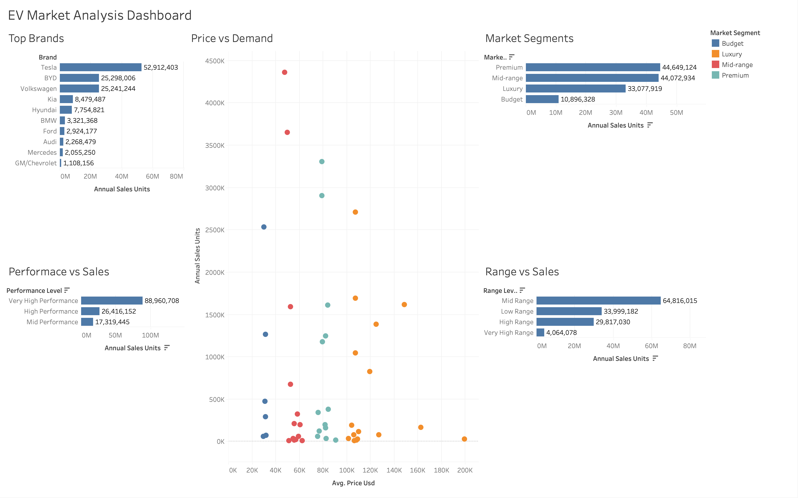

# EV Market 2026 Analysis

## Overview
This project explores trends in the electric vehicle (EV) market using SQL and Tableau. The goal is to understand how factors like pricing, performance, and driving range relate to EV sales and consumer demand.

## Objective
To analyze EV market data and identify patterns in:
- Top-performing brands
- Market segments
- Price vs demand
- Performance vs sales
- Range vs sales

## Tools Used
- MySQL
- SQL (data cleaning + exploratory data analysis)
- Tableau

## Data Cleaning
Before analysis, the dataset was checked for:
- Duplicate records
- Missing values and blanks
- Inconsistent formatting in text columns

No major issues were found, so minimal cleaning was required.

## Analysis Performed

1. Top Brands  
2. Market Segments  
3. Price vs Demand  
4. Performance vs Sales  
5. Range vs Sales  

## Key Insights

- Tesla, BYD, and Volkswagen lead total EV sales
- The Premium segment generated the highest total sales
- Higher-priced EV segments still maintained strong demand
- Higher-performance EVs tended to generate higher sales
- Mid-range EVs generated the highest sales based on driving range

## Tableau Dashboard

This interactive Tableau dashboard visualizes:
- EV brand sales performance
- Market segment trends
- Price vs demand relationships
- Performance vs sales
- Range vs sales comparisons

### Dashboard Preview



## Project Structure

```text
EV-Market-2026-Analysis/
│
├── EV_Market_2026_Data_Cleaning.sql
├── EV_Market_2026_Exploratory_Data_Analysis.sql
├── EV_MARKET_2026_Dashboard.twbx
├── EV_Market_Dashboard_Preview.png
└── README.md
```

## Notes
This dataset appears to be simulated and is used for analytical practice rather than real-world market forecasting.
